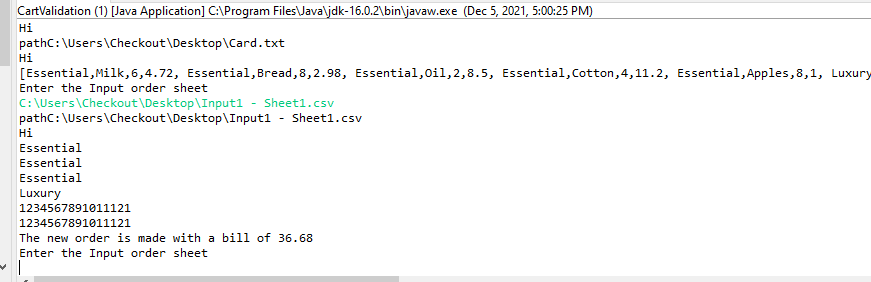
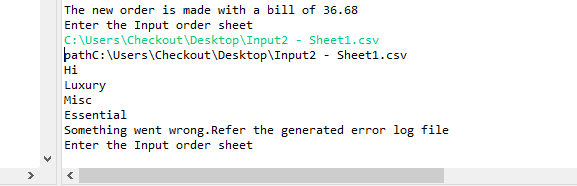
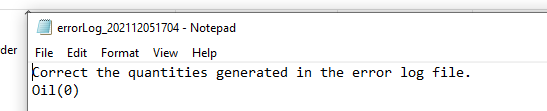
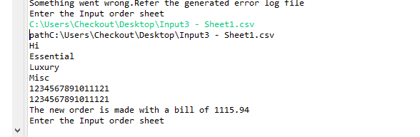
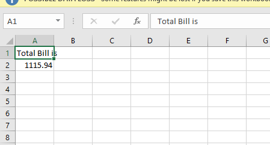
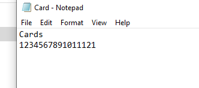

# individual-project-kapilgeet123

## Problem Statement
We have to make cart validation system . Input will be give a database file , input order file and card file path. We have to maintain a static database and design an application using design pattern. We have to parse the input file and generate the total bill amount. We also have to take into account about the cap on each category as well as the database quantity. Output the file with final amount to be paid.

## Instructions to run the application:

Needs Java 8 installed in the system that is running the program.

<h2> Instructions </h2>

 Environment requirements : Eclipse IDE 

<ol> 
  
  <li> Download the file by clicking Code -> Download ZIP on github repository </li>
  <li> Once downloaded, extract the .zip file and copy the entire folder <b>Individual_Project_Final</b> into your Eclipse workspace.</li>
  <li> Now, open Eclipse and go to File -> Import -> General -> Existing Projects into Workspace </li>
  <li> In the next window, choose the <b>Individual_Project_Final folder</b> as your root directory and click "Finish"</li>
  <li> Now, the project is imported </li>
  <li> Add the input files into your workspace where this project resides.</li>
     <li> Input file will be given in following order</li>
     <li>C:\...(Datasetpath)</li>
     <li>C:\.. (Cardfile)</li>
     <li>C:\..(finaloutputfile)</li>
  <li> Choose <b>Customer.java</b> and run this file. This is the file containing main().</li>
  <li> User will be prompted to "Enter the file name :" , enter the relevant input file name </li>
  <li> Project will run successfully and the corresponding output.csv or error.txt files will be created in the same project folder structure in the workspace.</li>
 
</ol>

## Design Patterns:
<ol>
     <li>-Iterator [click here] (https://github.com/gopinathsjsu/individual-project-kapilgeet123/blob/main/Documents/Screenshot/Iteratorpattern.pdf)</li>
     <li>-Singleton</li>
     <li>-Factory</li>
     <li> Explanation [Click here] (https://github.com/gopinathsjsu/individual-project-kapilgeet123/blob/main/Documents/202%20Report.pdf)
</ol>

## Screenshots of Test Cases:

### Test Case 1: 

#### Input:

     
#### Output:

### Test Case 2: 

#### Input:

     
#### Output:

### Test Case 3: 

#### Input:

     
#### Output:

### Card output: 

### Class digram:
[click here](https://github.com/gopinathsjsu/individual-project-kapilgeet123/blob/main/Documents/Screenshot/class%20diagram%204.pdf)

